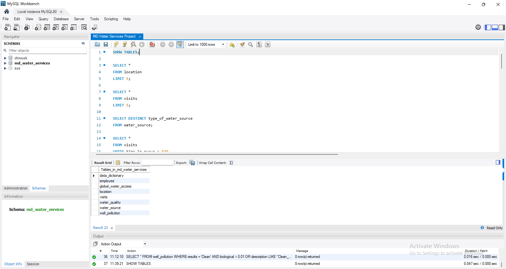
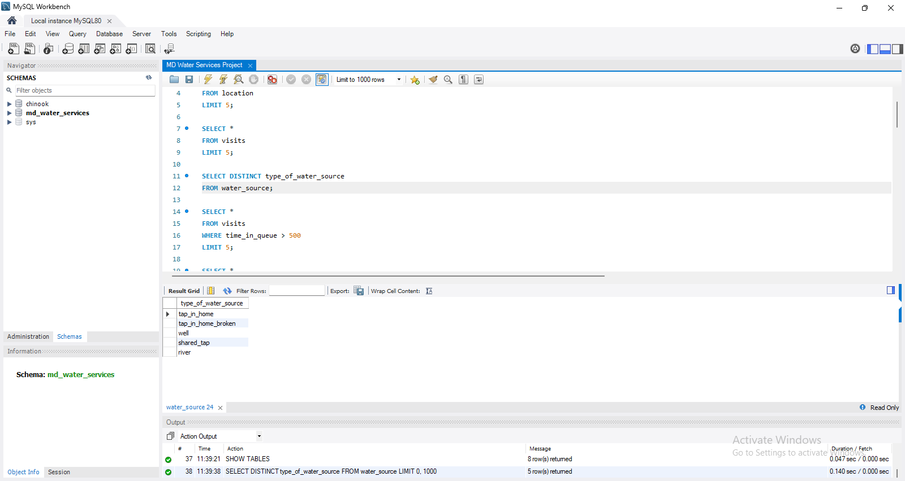
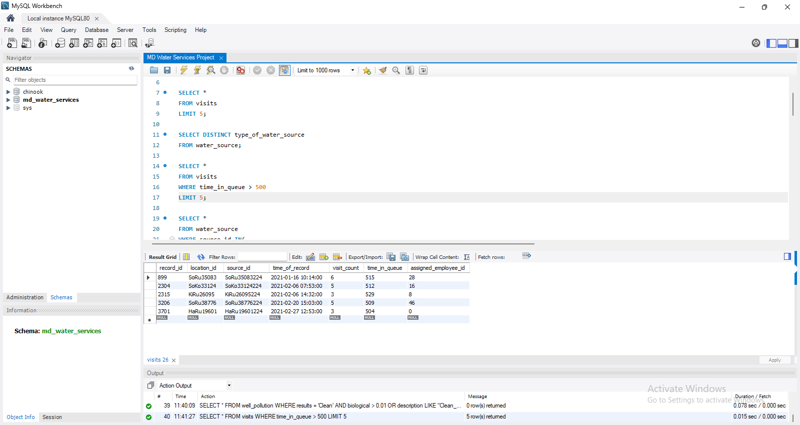
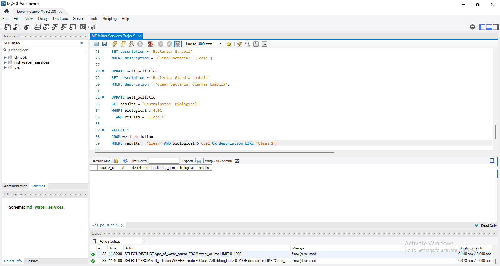

# Maji Ndogo Water Services SQL Analysis

## Project Overview

This project explores and cleans the **Maji Ndogo water services database** using SQL and MySQL Workbench.

The analysis focuses on understanding the structure of the database, exploring different water sources, investigating unusually long queue times, reviewing water-quality records, and identifying inconsistencies in well-pollution data.

A key part of the project involved detecting records that were incorrectly labelled as **Clean** despite showing signs of biological contamination, then testing and applying corrective updates safely.

---

## Problem Statement

The Maji Ndogo water services dataset contains survey data collected from different locations and water sources.

The project was designed to answer questions such as:

- What types of water sources are available?
- Which water sources experience unusually long queue times?
- Are there inconsistencies in water-quality records?
- Are contaminated wells being incorrectly classified as clean?
- How can these data-quality issues be corrected safely?

---

## Objectives

The main objectives of the project were to:

- Explore the structure of the Maji Ndogo database.
- Review the main tables and understand the information they contain.
- Identify unique types of water sources.
- Investigate very long queue times at water sources.
- Match selected source IDs to their corresponding source types.
- Examine water-quality records for unusual patterns.
- Investigate well-pollution records.
- Identify incorrectly labelled contamination records.
- Clean incorrect pollution descriptions and classifications.
- Validate changes before applying them to the original table.

---

## Dataset / Data Source

The project uses the **Maji Ndogo water services database** supplied as a MySQL SQL script.

The database contains eight main tables:

- `data_dictionary`
- `employee`
- `global_water_access`
- `location`
- `visits`
- `water_quality`
- `water_source`
- `well_pollution`

The dataset and project instructions were provided as part of the **ExploreAI Academy Maji Ndogo project**.

> Dataset link: [Add source link if available]

---

## Tools & Technologies

| Tool | Purpose |
|---|---|
| MySQL | Database querying and data manipulation |
| MySQL Workbench | Running and testing SQL queries |
| SQL | Data exploration, filtering, validation, and cleaning |
| Git | Version control |
| GitHub | Project documentation and portfolio hosting |

---

## Project Workflow

### 1. Database Exploration

I began by inspecting the database structure and reviewing records from the available tables.

```sql
SHOW TABLES;
```

I then explored sample records from the tables using `SELECT` statements with `LIMIT`.

---

### 2. Water Source Analysis

I identified the unique types of water sources in the database.

```sql
SELECT DISTINCT type_of_water_source
FROM water_source;
```

The five water-source categories identified were:

- `tap_in_home`
- `tap_in_home_broken`
- `well`
- `shared_tap`
- `river`

---

### 3. Queue-Time Investigation

I investigated visits where people waited more than 500 minutes for water.

```sql
SELECT *
FROM visits
WHERE time_in_queue > 500;
```

Selected `source_id` values were then matched to their corresponding water-source types using the `IN()` operator.

```sql
SELECT *
FROM water_source
WHERE source_id IN (
    'AkKi00881224',
    'AkLu01628224',
    'AkRu05234224',
    'HaRu19601224',
    'HaZa21742224',
    'SoRu36096224',
    'SoRu37635224',
    'SoRu38776224'
);
```

This helped connect long queue times to specific types of water sources.

---

### 4. Water Quality Checks

I examined records where the subjective quality score was 10 and the source had been visited a second time.

```sql
SELECT *
FROM water_quality
WHERE subjective_quality_score = 10
  AND visit_count = 2;
```

This returned **218 records** that required further investigation because high-quality home water sources were not expected to have repeat visits.

---

## Data Cleaning and Validation

### 5. Pollution Data Investigation

I first reviewed the `well_pollution` table.

```sql
SELECT *
FROM well_pollution
LIMIT 10;
```

I then searched for descriptions that incorrectly began with the word `Clean`.

```sql
SELECT *
FROM well_pollution
WHERE description LIKE 'Clean_%';
```

This identified **38 incorrect descriptions**.

I also checked for wells that were labelled as clean even though their biological contamination level was above `0.01`.

```sql
SELECT *
FROM well_pollution
WHERE results = 'Clean'
  AND biological > 0.01;
```

---

### 6. Safe Data Cleaning

Before modifying the original data, I created a copy of the pollution table.

```sql
CREATE TABLE well_pollution_copy AS
SELECT *
FROM well_pollution;
```

I then corrected the inconsistent descriptions.

```sql
UPDATE well_pollution_copy
SET description = 'Bacteria: E. coli'
WHERE description = 'Clean Bacteria: E. coli';
```

```sql
UPDATE well_pollution_copy
SET description = 'Bacteria: Giardia Lamblia'
WHERE description = 'Clean Bacteria: Giardia Lamblia';
```

I also corrected records that were incorrectly classified as clean.

```sql
UPDATE well_pollution_copy
SET results = 'Contaminated: Biological'
WHERE biological > 0.01
  AND results = 'Clean';
```

---

### 7. Validation

After applying the updates to the copy, I checked whether any of the known errors remained.

```sql
SELECT *
FROM well_pollution_copy
WHERE description LIKE 'Clean_%'
   OR (results = 'Clean' AND biological > 0.01);
```

Once the updates were confirmed to work correctly, the same corrections were applied to the original `well_pollution` table.

The temporary copy was then removed.

```sql
DROP TABLE well_pollution_copy;
```

---

## Key Findings

- The database contains **five main types of water sources**.
- Some recorded water queues exceeded **500 minutes**.
- Many of the investigated long-queue sources were shared taps.
- **218 water-quality records** with a quality score of 10 and a second visit required additional review.
- **38 well-pollution descriptions** incorrectly contained the word `Clean`.
- Some wells were classified as `Clean` even though biological contamination exceeded `0.01`.
- Incorrect descriptions for **E. coli** and **Giardia Lamblia** were corrected.
- Incorrect pollution results were updated from `Clean` to `Contaminated: Biological`.
- A backup-table workflow was used to test changes before modifying the original data.

---

## Recommendations

Based on the analysis:

- Use validation rules to prevent contaminated samples from being classified as clean.
- Standardize free-text pollution descriptions to reduce data-entry inconsistencies.
- Validate records before applying permanent database updates.
- Use backup or temporary tables when performing important data-cleaning operations.
- Investigate unusually long queue times further, especially at shared taps.
- Review unexpected repeat visits in the water-quality data.
- Continue auditing field-survey data before using it for operational decision-making.

---

## Visualizations

This stage of the project focused on **SQL-based exploration and data cleaning**, so no dashboard or chart was created.

## Project Screenshots

### Database Overview


### Water Source Analysis


### Queue-Time Analysis


### Pollution Data Validation



### Main Files

**`MD Water Services Project.sql`**  
Contains the SQL queries used for database exploration, analysis, validation, and cleaning.

**`md_water_services.sql`**  
Contains the script used to create and populate the original Maji Ndogo database.

**`README.md`**  
Contains the project documentation, methodology, findings, and instructions.

---

## How to Run the Project

1. Install **MySQL Server** and **MySQL Workbench**.
2. Clone or download this repository.
3. Open `md_water_services.sql` in MySQL Workbench.
4. Execute the script to create and populate the database.
5. Confirm that the `md_water_services` database exists.
6. Open `MD Water Services Project.sql`.
7. Run the queries in sequence.
8. Review the outputs at each stage of the analysis.
9. When testing `UPDATE` statements, use `well_pollution_copy` before changing the original table.
10. Run validation queries to confirm that the targeted inconsistencies have been resolved.

---

## Conclusion

This project demonstrates a practical SQL workflow for exploring, validating, and cleaning a relational database.

The project involved more than retrieving records. It required investigating unusual patterns, identifying data-quality problems, testing corrections safely, and validating the results before applying permanent changes.

The project strengthened my understanding of:

- SQL querying
- Filtering and pattern matching
- Data-quality validation
- Data cleaning
- Safe database updates
- Relational database exploration

---

## Author

**Yekini Abdulroqeeb Ademola**

- GitHub: [Abdulroqeeb04](https://github.com/Abdulroqeeb04)
- LinkedIn: www.linkedin.com/in/abdulroqeeb-yekini22
```
